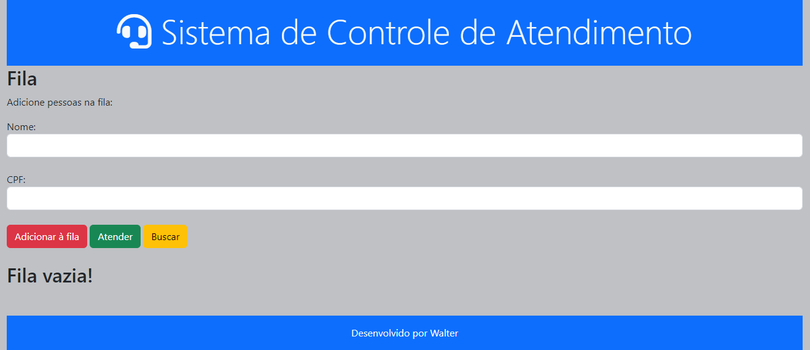
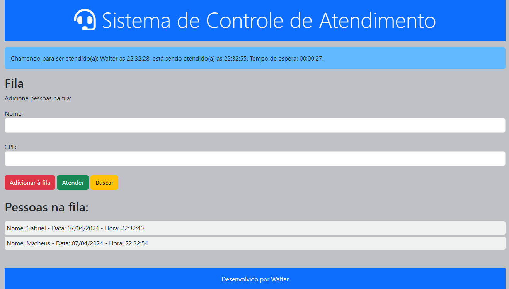

# <h1 align="center">Site Fila de Atendimento</h1>

### Tecnologias Utilizadas:
* JavaScript
* HTML
* CSS

### Ferramentas Utilizadas:
* Visual Studio Code

### Funções do Software:
* Verificação do novo recorde antes de adicioná-lo à lista principal;
* Movimentação de um recorde da lista principal para a lista auxiliar;
* Visualização das listas em tempo real nas áreas de listagem;

### Tela principal:

<figure>
  
</figure>
<figure>
  
</figure>
